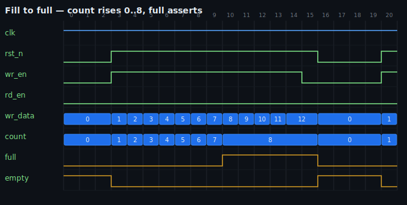
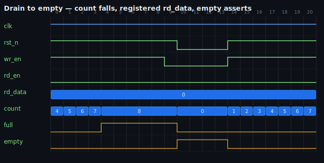
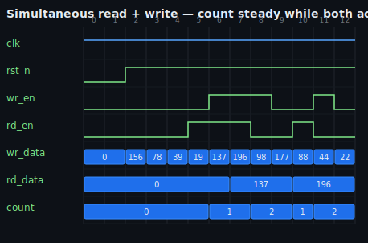
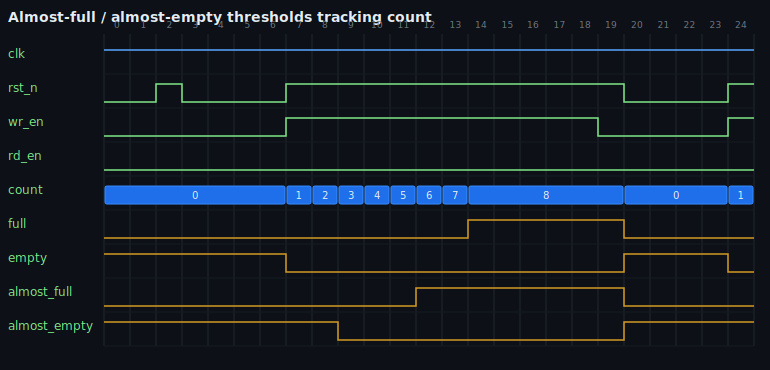

# SystemVerilog FIFO Verification Suite

Eight parameterized FIFO designs — synchronous, asynchronous CDC, AXI4-Stream, packet, width-converter, and ECC — formally verified with SymbiYosys, exhaustively simulated with Verilator, mutation-tested, and characterized on real FPGA silicon (ECP5 + iCE40). Every claim is backed by a reproducible `make` target; CI runs them all on every push.

[](https://github.com/billdmar/fifo-verification-suite/actions/workflows/ci.yml)
[](LICENSE)
[](https://github.com/YosysHQ/sby)

---

## Designs

| Design | Description | Formal | Sim |
|--------|-------------|--------|-----|
| `sync_fifo` | Single-clock, extra-MSB dual-pointer, registered read | BMC d=20 + k-induction **PROVEN** | 13 tests + 120k random cycles |
| `sync_fifo_fwft` | Same core, zero-latency show-ahead read | BMC d=20 + k-induction **PROVEN** | C++ scoreboard |
| `async_fifo` | Dual-clock CDC, Gray-code + multi-flop synchronizers | Multi-clock BMC d=16 | cocotb + C++ |
| `axis_fifo` | AXI4-Stream wrapper with output skid register | BMC d=20, protocol compliance | — |
| `sync_fifo_width` | Asymmetric-width (WR ≠ RD), both directions | BMC d=14, up + down | C++ golden pack/unpack |
| `axis_width_conv` | AXI4-Stream width converter on `sync_fifo_width` | BMC d=14 | — |
| `axis_pkt_fifo` | Store-and-forward packet FIFO (TLAST-aware) | BMC d=14, atomicity proven | C++ scoreboard |
| `sync_fifo_ecc` | SECDED fault-tolerant (13,8 Hamming) | Correct/detect proven over **every** error position | C++ + fault injection |

All designs: parameterizable `DATA_WIDTH` (1–64) and `DEPTH` (4–1024, power of 2). Cover witnesses, fault-injection anti-vacuity tests, and 100% Verilator structural coverage close the verification loop.

---

## Quickstart

```sh
# Install OSS CAD Suite (https://github.com/YosysHQ/oss-cad-suite-build/releases)
source ~/oss-cad-suite/environment

git clone https://github.com/billdmar/fifo-verification-suite.git
cd fifo-verification-suite

make lint          # Verilator + Verible style gates (all 8 designs)
make formal-bmc    # Bounded model check — the CI gate
make sim           # Verilator simulation + functional coverage
make all           # Full CI: lint + synth + formal + sim + coverage
```

Run `make help` for the complete target list (FPGA P&R, mutation testing, bitstream build, waveform generation, performance characterization).

---

## What's Proven vs. What's Tested

| Level | What | Scope |
|-------|------|-------|
| **PROVEN** (unbounded, k-induction) | Mutual exclusion, pointer/count invariants, progress/no-deadlock, FWFT correctness | `sync_fifo`, `sync_fifo_fwft`, `sync_fifo_ecc` |
| **BMC-bounded** (depth 14–20) | Data integrity (`$anyconst` tracker), protocol compliance, CDC safety, packet atomicity | All 8 designs |
| **Simulation-validated** | Data ordering over 120k random cycles, coverage closure, fault-injection anti-vacuity | All designs with testbenches |
| **Out of scope** (stated honestly) | True unbounded liveness (`suprove` not bundled), analog metastability, vendor timing | Documented limitations |

Full methodology: [docs/formal_proof_methodology.md](docs/formal_proof_methodology.md) · [docs/proven_vs_tested.md](docs/proven_vs_tested.md) · [docs/traceability.md](docs/traceability.md)

---

## Mutation Testing

`make mutate` runs [mcy](https://github.com/YosysHQ/mcy) (Mutation Cover with Yosys) against `sync_fifo`: **92% kill-rate**, all 8 survivors proven to be equivalent mutants (0 real coverage gaps). Per-design explorations for async and AXI variants. Details: [docs/mutation_testing.md](docs/mutation_testing.md)

---

## FPGA Characterization

Real Yosys + nextpnr place-and-route on Lattice ECP5 (LFE5U-85F) and iCE40 (UP5K) across the full depth sweep. The design maps to distributed LUT RAM when shallow and block RAM when deep — no source changes.

| Part | DEPTH=8 Fmax | DEPTH=256 Fmax |
|------|--------------|----------------|
| ECP5 LFE5U-85F | 266.8 MHz | 221.3 MHz |
| iCE40 UP5K | 59.2 MHz | 72.7 MHz |

Full tables and methodology: [docs/fpga_results.md](docs/fpga_results.md). Reproduce: `make fpga-report` / `make bitstream`.

---

## Waveforms

Generated from real simulation VCD (`make waveforms`). The 1-cycle registered read latency of `sync_fifo` is visible in the timing.

| Fill to full | Drain to empty |
|---|---|
|  |  |

| Simultaneous read + write | Threshold flags |
|---|---|
|  |  |

---

## Architecture

The core `sync_fifo` uses a dual-pointer ring buffer with an extra MSB bit for unambiguous empty/full detection:

```
  wr_en, wr_data ──►  ┌─────────────────────────────────┐
                       │       sync_fifo                  │
                       │  wptr[ADDR_WIDTH:0]              │
                       │        │                         │
                       │        ▼                         │
                       │   mem[0..DEPTH-1]                │  ◄── DATA_WIDTH bits
                       │        ▲                         │
                       │        │                         │
                       │  rptr[ADDR_WIDTH:0]              │
  rd_en ────────────►  │                                  │  ──► rd_data
                       │  empty = (wptr == rptr)          │  ──► full, empty, count
                       │  full  = MSBs differ, low match  │
                       └─────────────────────────────────┘
```

The extra MSB flips on each pointer wrap, disambiguating the state where `wptr[low] == rptr[low]` between empty (both wrapped same count) and full (writer one lap ahead). See the RTL source header for a worked DEPTH=4 example.

The `async_fifo` extends this with Gray-code pointer encoding and multi-flop CDC synchronizers — architecture diagram in [docs/cdc_architecture.md](docs/cdc_architecture.md).

---

## Documentation

| Document | Contents |
|----------|----------|
| [docs/formal_proof_methodology.md](docs/formal_proof_methodology.md) | How the proofs work: extra-MSB, k-induction, `$anyconst` trackers, CDC |
| [docs/proven_vs_tested.md](docs/proven_vs_tested.md) | Honest split: proven vs. BMC-bounded vs. simulated vs. out of scope |
| [docs/traceability.md](docs/traceability.md) | Requirement → property → witness matrix (all designs) |
| [docs/verification_matrix.md](docs/verification_matrix.md) | Consolidated per-design proof/test status |
| [docs/assertions.md](docs/assertions.md) | Per-property assertion catalogue + density metric |
| [docs/mutation_testing.md](docs/mutation_testing.md) | mcy kill-rate analysis + survivor classification |
| [docs/fpga_results.md](docs/fpga_results.md) | ECP5 + iCE40 area/timing tables |
| [docs/perf_results.md](docs/perf_results.md) | Cycle-accurate throughput and latency |
| [docs/cdc_architecture.md](docs/cdc_architecture.md) | Async CDC architecture + Mermaid diagram |
| [docs/datasheet.md](docs/datasheet.md) | Signal/parameter/performance quick reference |
| [CONTRIBUTING.md](CONTRIBUTING.md) | How to build, test, and add a verified design |

---

## Toolchain

100% open-source: OSS CAD Suite 2026-06-04 (Yosys 0.64, SymbiYosys 0.66, Verilator 5.049, nextpnr 0.10, cocotb, mcy) + Verible. Tested on macOS (darwin-arm64) and Linux (CI).

---

## License

MIT — see [LICENSE](LICENSE).
Copyright (c) 2026 William Mar.
