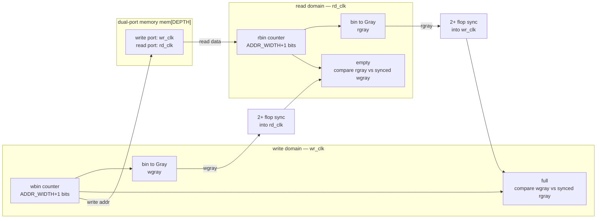

# Clock-Domain-Crossing Architecture — `async_fifo`

The asynchronous FIFO bridges two independent clock domains — a write domain
(`wr_clk`/`wr_rst_n`) and a read domain (`rd_clk`/`rd_rst_n`) — using the
textbook (Cummings) Gray-code-pointer + multi-flop-synchronizer design.

## Why each piece exists

**Gray-code pointers.** A binary counter can change many bits at once
(`0111 → 1000`). If that value is sampled mid-transition by a flop in the other
clock domain, the captured value can be an arbitrary mix of old and new bits — a
nonsense integer. Gray code guarantees **exactly one bit changes per step**, so
a mid-flight sample resolves to either the old or the new value, never a bogus
third one. Each pointer keeps a normal binary counter locally (for addressing
`mem[]` and computing occupancy) and converts to Gray (`g = b ^ (b >> 1)`) only
for the bits that cross domains.

**Multi-flop synchronizers (`SYNC_STAGES`, default 2).** When a Gray pointer
crosses into the other domain it passes through a chain of `SYNC_STAGES`
flip-flops. The first flop may go metastable on a setup/hold violation; the
extra stage(s) give it time to resolve to a stable 0 or 1 before any logic
consumes it. More stages → lower probability of a metastable value propagating
(higher MTBF), at the cost of latency.

**Conservative full/empty.** `full` is computed in the write domain by comparing
the local write-Gray pointer against the read-Gray pointer *synchronized into the
write domain*; `empty` is computed symmetrically in the read domain. Because a
synchronized pointer is always **stale-or-current** (never ahead), the flags err
only in the safe direction: `full` may assert slightly early and `empty` may
de-assert slightly late — the FIFO can never overflow or underflow.

## What formal verification does and does not cover here

The multi-clock formal harness (`$global_clock` + per-domain clock-enable gating,
`formal/async_fifo_bmc.sby`, BMC depth 16) exercises **all relative clock phases
and rates** — the functional CDC risk — and proves the Gray-one-bit invariant,
pointer monotonicity, no-overflow/underflow, occupancy bounds, and cross-domain
data integrity (BMC-bounded).

It does **not** model analog metastability resolution time — that is an
electrical/STA concern, and the `SYNC_STAGES` flop chain is the mitigation, not
something an open-source functional prover can discharge. See
[`proven_vs_tested.md`](proven_vs_tested.md) for the full proven-vs-tested split.
